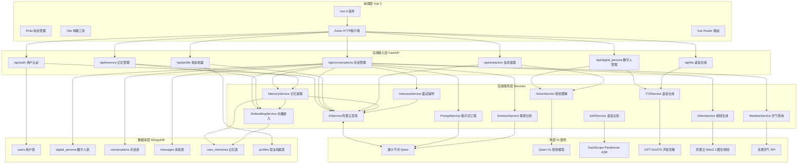
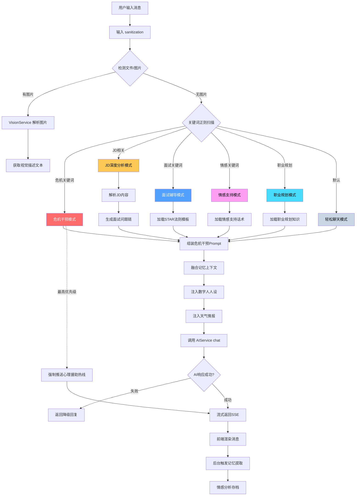
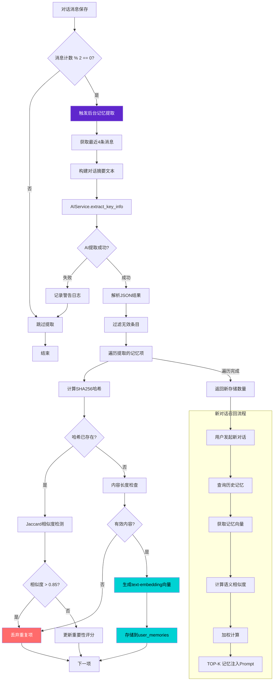
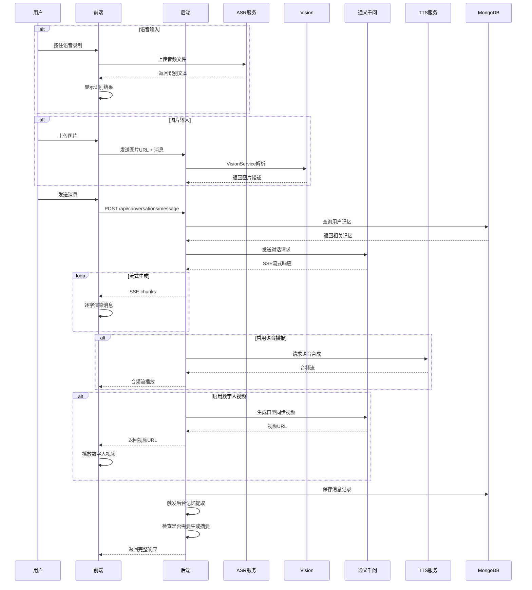
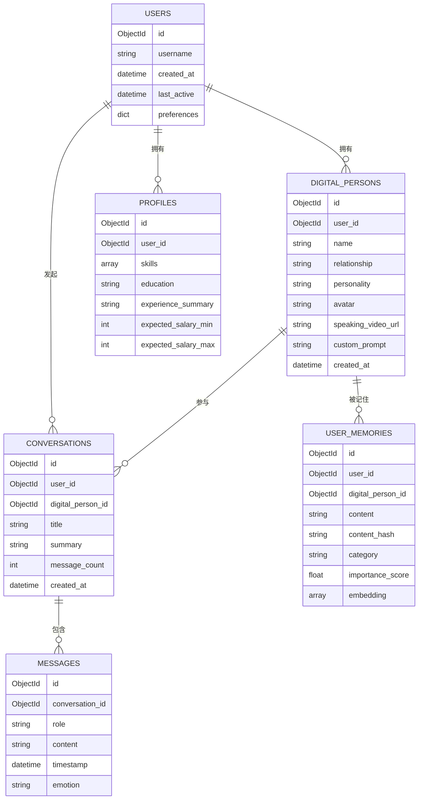
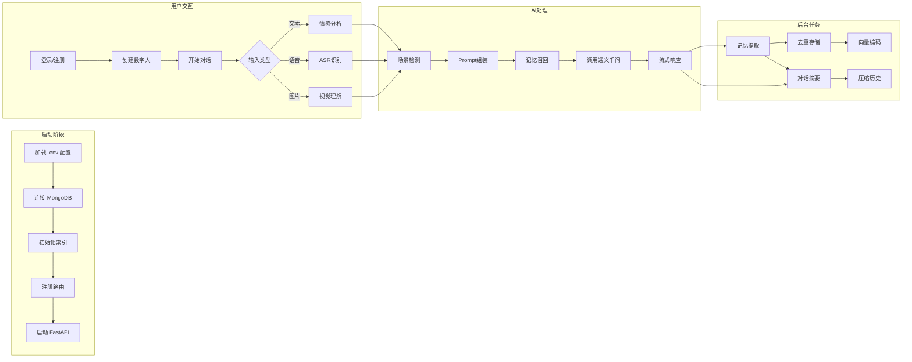

# 数字人情感陪伴系统 - 架构设计文档

## 目录
1. [系统总体架构图](#1-系统总体架构图)
2. [多场景智能对话动态路由流程图](#2-多场景智能对话动态路由流程图)
3. [智能记忆生命周期流程图](#3-智能记忆生命周期流程图)
4. [多模态交互时序图](#4-多模态交互时序图)
5. [数据库表设计](#5-数据库表设计)
6. [核心代码逻辑分析](#6-核心代码逻辑分析)

---

## 1. 系统总体架构图



---

## 2. 多场景智能对话动态路由流程图



---

## 3. 智能记忆生命周期流程图



---

## 4. 多模态交互时序图



---

## 5. 数据库表设计

### 5.1 MongoDB Collections 概览

| Collection | 说明 | 关键字段 |
|------------|------|----------|
| users | 用户表 | username, preferences |
| digital_persons | 数字人表 | user_id, name, avatar, speaking_video_url |
| conversations | 对话表 | user_id, digital_person_id, summary |
| messages | 消息表 | conversation_id, role, content, emotion |
| user_memories | 记忆表 | user_id, digital_person_id, content, category, embedding |
| profiles | 职业档案表 | user_id, skills, education |

### 5.2 详细表结构



### 5.3 索引设计

```javascript
// users 集合
db.users.createIndex({ "username": 1 }, { unique: true })
db.users.createIndex({ "created_at": -1 })

// digital_persons 集合
db.digital_persons.createIndex({ "user_id": 1 })
db.digital_persons.createIndex({ "user_id": 1, "created_at": -1 })

// conversations 集合
db.conversations.createIndex({ "user_id": 1, "updated_at": -1 })
db.conversations.createIndex({ "digital_person_id": 1 })

// messages 集合
db.messages.createIndex({ "conversation_id": 1, "timestamp": 1 })

// user_memories 集合
db.user_memories.createIndex({ "user_id": 1, "digital_person_id": 1 })
db.user_memories.createIndex({ "content_hash": 1 })
db.user_memories.createIndex({ "user_id": 1, "category": 1 })
```

---

## 6. 核心代码逻辑分析

### 6.1 多场景路由优先级

| 优先级 | 场景 | 关键词示例 |
|--------|------|------------|
| 1 | 危机干预 | 不想活/想死/轻生/自杀/抑郁症/绝望 |
| 2 | JD深度分析 | JD/岗位描述/招聘要求 |
| 3 | 面试辅导 | 面试/offer/STAR法则/群面/笔试 |
| 4 | 情感支持 | 焦虑/迷茫/压力/难过/孤独 |
| 5 | 职业规划 | 职业/工作/就业/职场/跳槽 |
| 6 | 轻松聊天 | 默认 |

### 6.2 记忆提取算法

```
去重双重机制:
1. SHA256 哈希精确匹配
2. Jaccard 相似度检测 (阈值 0.85)

存储向量维度: 1536 (text-embedding-v3)

召回权重计算:
召回分数 = 语义相似度 x 0.7 + 重要性评分 x 0.3
```

### 6.3 并发控制

```
每用户最大并发: 2
限流策略: Semaphore 信号量
超时监控: 45秒 Watchdog
```

### 6.4 提示词组装顺序

```
1. 数字人基础人设 (name, relationship, personality)
2. 场景专属Prompt片段 (SCENE_PROMPTS[scene])
3. 用户职业档案 (profile)
4. 相关记忆上下文 (user_memories)
5. 天气情报 (weather)
6. 历史摘要 (summary)
7. 安全准则 (SAFETY_RULES)
```

---

## 7. 系统运行流程总览



---

*文档生成时间: 2026-04-11*
